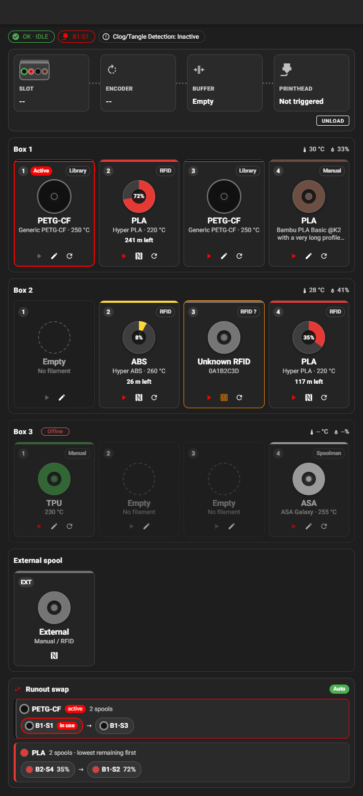
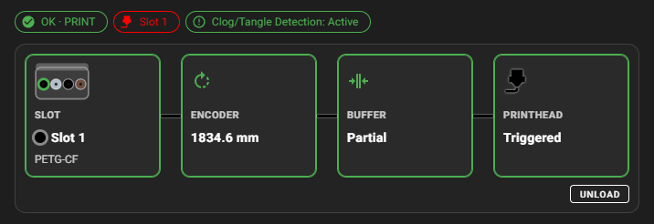
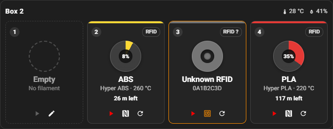
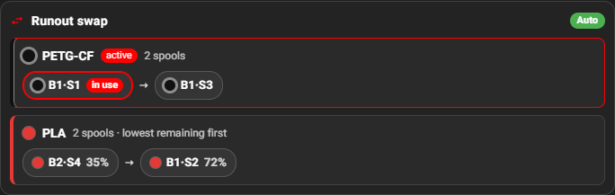
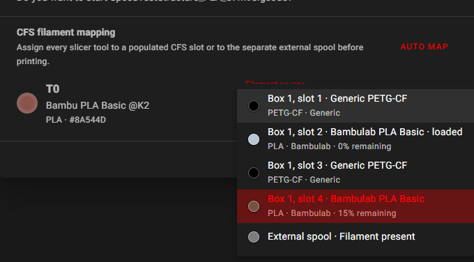
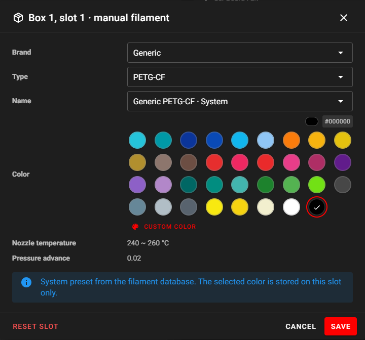
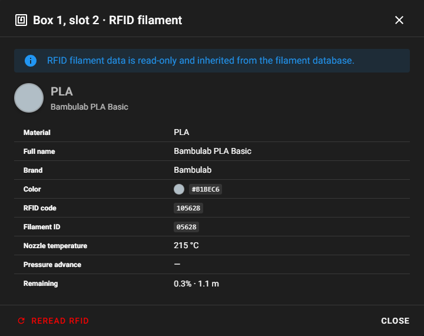
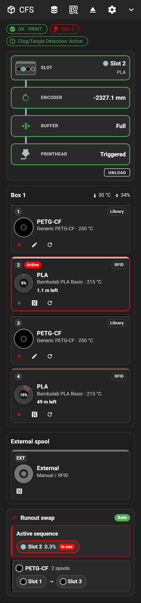
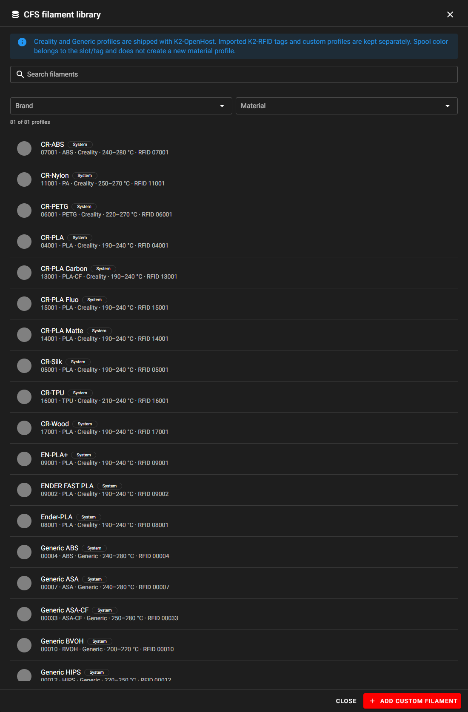

  <a>
    
    <h1 align="center">Mainsail</h1>
  </a>

  Makes Klipper more accessible by adding a lightweight, responsive web user interface, centred around an intuitive and consistent design philosophy.

  
  
  
  
  
  
   
  
  
  

## K2-OpenHost fork

This fork adds a native **Creality CFS** (Creality Filament System) panel and print-start mapping to Mainsail for [K2-OpenHost](https://github.com/MzTechnology97/K2-OpenHost), where a Creality K2 Pro runs Kalico + Moonraker on an external host. It reads only the Klipper `box` object through Moonraker; the rest of Mainsail is unchanged upstream code.

  

### What it adds

| Feature              | What you get                                                                                                                                                                             |
| -------------------- | ---------------------------------------------------------------------------------------------------------------------------------------------------------------------------------------- |
| **CFS panel**        | One section per CFS unit with its own temperature/humidity and offline state, plus the external spool. Status chips for box state, loaded slot and clog/tangle detection                 |
| **Filament path**    | CFS → encoder → buffer → printhead, with a CFS icon in the real bay colours, a nozzle that takes the filament colour, and a filament-coloured line through the stages that hold filament |
| **Slot tiles**       | Colour stripe, RFID remaining gauge, material, name and temperature, source badge (RFID / Library / Spoolman / Manual), active state; load, edit, RFID and reread actions                |
| **Runout swap**      | Groups of identical spools with order, strategy and remaining filament; the group in use is marked active                                                                                |
| **Slot editor**      | Brand → Type → Profile → Colour for non-RFID spools, with a preset palette and custom colours                                                                                            |
| **RFID**             | Read-only tag data, per-slot reread, and a one-click flow to create a profile for an unknown tag                                                                                         |
| **Filament library** | Read-only Creality/Generic K2-RFID catalog plus custom profiles, with search and brand/material filters                                                                                  |
| **Print mapping**    | The Print dialog maps every slicer tool to a CFS slot (auto-map + manual choice) and starts with `BOX_PRINT_START`                                                                       |
| **Any screen**       | Layout follows the panel width (container queries): 4, 2 or 1 tile columns, compact tiles in narrow dashboard columns, larger touch targets                                              |
| **Several CFS**      | Up to four units, with unit-aware slot names (`Slot 3` with one CFS, `B2·S4` with several)                                                                                               |

### Screenshots

| Filament path while printing                                                                   | Slot tile states                                                                     |
| ---------------------------------------------------------------------------------------------- | ------------------------------------------------------------------------------------ |
|  |  |

| Runout swap groups                                                                     | Print dialog mapping                                                                     |
| -------------------------------------------------------------------------------------- | ---------------------------------------------------------------------------------------- |
|  |  |

| Slot editor                                                                           | RFID information                                                                         |
| ------------------------------------------------------------------------------------- | ---------------------------------------------------------------------------------------- |
|  |  |

| Phone                                                                                  | Filament library                                                                                |
| -------------------------------------------------------------------------------------- | ----------------------------------------------------------------------------------------------- |
|  |  |

Views with several CFS units use simulated status data; the development printer has one unit.

### Documentation

- [`docs/K2_CFS.md`](docs/K2_CFS.md): every K2-OpenHost feature, section by section, with the backend contract, commands, layout rules and validation status.
- [`K2-OPENHOST.md`](K2-OPENHOST.md): how this fork fits the K2-OpenHost architecture, credits and update/deployment notes.

Upstream Mainsail documentation: [docs.mainsail.xyz](https://docs.mainsail.xyz).
