# Creality CFS in Mainsail K2-OpenHost

Updated: **2026-10-03**.

This fork adds a native **CFS** (Creality Filament System) panel and print-start mapping to Mainsail for the [K2-OpenHost](https://github.com/MzTechnology97/K2-OpenHost) project, where a Creality K2 Pro runs Kalico + Moonraker on an external host. Everything on this page was built for K2-OpenHost; the rest of Mainsail is unchanged upstream code.

The UI reads only the Klipper/Kalico `box` object through Moonraker. It does not parse RS-485, does not talk to Creality's private web service and never reads the backend's JSON state file.

```text
CFS hardware --RS-485--> Kalico box extras --> printer.objects.box --> Moonraker --> Mainsail
```

Screenshots were taken on the development K2 Pro (one CFS). Views that show several CFS units use simulated status data injected into the page, because only one unit is connected.

## Contents

1. [Dashboard panel](#1-dashboard-panel)
2. [Filament path](#2-filament-path)
3. [CFS units and slot tiles](#3-cfs-units-and-slot-tiles)
4. [Several CFS units](#4-several-cfs-units)
5. [Runout swap](#5-runout-swap)
6. [Settings menu](#6-settings-menu)
7. [Slot editor (non-RFID spools)](#7-slot-editor-non-rfid-spools)
8. [RFID spools](#8-rfid-spools)
9. [Filament library (filament database)](#9-filament-library-filament-database)
10. [Example: adding a custom filament](#10-example-adding-a-custom-filament)
11. [Print dialog: tool → slot mapping](#11-print-dialog-tool--slot-mapping)
12. [Layout on any screen](#12-layout-on-any-screen)
13. [Slot names](#13-slot-names)
14. [Backend contract](#14-backend-contract)
15. [Commands sent by the UI](#15-commands-sent-by-the-ui)
16. [Persistence](#16-persistence)
17. [Deployment on the CM5](#17-deployment-on-the-cm5)
18. [Validation status](#18-validation-status)

---

## 1. Dashboard panel

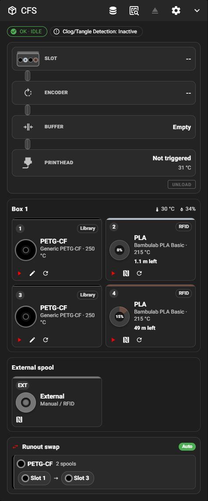

The panel is called **CFS** in the dashboard and in _Settings → Dashboard_, with its own icon. It shows, from top to bottom:

- **Status chips**:
  - Box status and mode (`OK · Idle`, `Loaded`, `Active` while tracking a print);
  - the slot currently loaded in the printhead;
  - clog/tangle detection state (`Inactive`, `Active`, `Triggered`, `Disabled`).
    The status chip tooltip shows the API versions.
- **Recovery alert** when a CFS operation blocked the print. It shows the backend reason; `RESUME` retries the step.
- **[Filament path](#2-filament-path)** from the CFS to the nozzle.
- One **section per CFS unit**, then the **external spool**.
- **[Runout swap](#5-runout-swap)** groups.

Header buttons: filament library, RFID scan of all populated slots, unload, and the settings menu. Manual actions are disabled while a print is running.

## 2. Filament path

| Idle                                                                                                     | Loading (simulated)                                                                                        |
| -------------------------------------------------------------------------------------------------------- | ---------------------------------------------------------------------------------------------------------- |
| 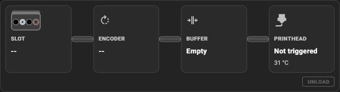               | 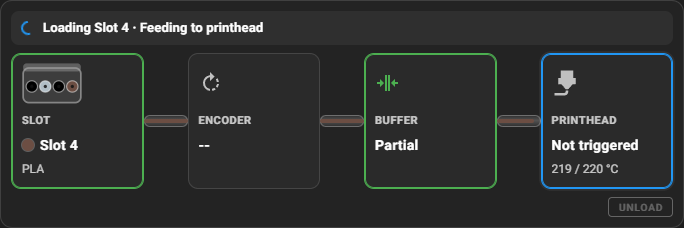     |
| **Printing (simulated)**                                                                                 | **Unloading (simulated)**                                                                                  |
|  | 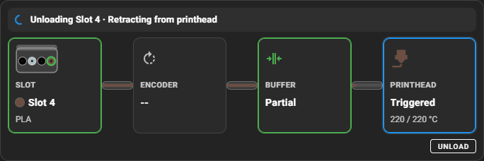 |

The path follows the filament from the CFS to the printhead, in the spirit of the _Filament Box_ widget of Jacob10383's K2 firmware:

| Stage          | Shows                                                                                                                    | Highlighted when                               |
| -------------- | ------------------------------------------------------------------------------------------------------------------------ | ---------------------------------------------- |
| **CFS / Slot** | A CFS icon with its four bays in their real filament colours (the loaded bay is ringed), then the slot name and material | a slot feeds the printhead, or is being loaded |
| **Encoder**    | Feed encoder position in mm                                                                                              | the Box tracks a print                         |
| **Buffer**     | `Empty`, `Partial` or `Full`                                                                                             | filament is in the buffer                      |
| **Printhead**  | Nozzle icon, `Triggered` / `Not triggered`, hotend temperature and target                                                | the printhead filament sensor sees filament    |

**PTFE tube.** The stages are joined by a translucent PTFE tube. Inside it runs the filament, in the real colour of the spool, and it reaches only as far as the sensors report:

- the CFS slot feeding the path fills the tube from the CFS;
- filament in the buffer (either limit switch) fills it up to the buffer;
- the printhead sensor fills it up to the nozzle, which also takes the filament colour.

Very dark or very light filament gets a contrast outline.

**Live loads and unloads.** A load can wait up to 45 s on a single CFS command, and the Box status refresh is paused during operations. The backend therefore publishes an `operation` status that changes at every step. While a load or unload runs:

- a banner shows the step, for example `Loading Slot 4 · Feeding to printhead`;
- the stage the filament is moving into pulses in the info colour;
- the tube segment being filled or emptied is animated in the direction of travel.

Steps of a full colour change, such as `flush`, appear in the banner too. The printhead stage reads the Klipper filament sensor object directly, so it changes the moment the filament arrives or leaves. Users who prefer reduced motion get a static view.

| Step                        | Banner text                        | Tube                        |
| --------------------------- | ---------------------------------- | --------------------------- |
| `preparing`                 | Preparing                          | unchanged                   |
| `feeding_to_buffer`         | Feeding to buffer                  | CFS → buffer filling        |
| `feeding_to_printhead`      | Feeding to printhead               | buffer → printhead filling  |
| `seating`, `verifying`      | Seating in the extruder, Verifying | full                        |
| `retracting_from_printhead` | Retracting from printhead          | buffer → printhead emptying |
| `retracting_to_cfs`         | Retracting to CFS                  | CFS → buffer emptying       |

Stages holding filament get a green outline; errors turn a stage red. An **Unload** button sits under the path.

The buffer value is the state of its two limit switches. Creality's firmware calls them the _empty limit_ and the _full limit_, and an idle unloaded K2 reports `2`, so the UI reads bit 0 as full and bit 1 as empty.

On a narrow panel the stages stack vertically and the tube runs under the icons:

| Idle                                                                                                  | Loading (simulated)                                                                                         | Printing (simulated)                                                                                          |
| ----------------------------------------------------------------------------------------------------- | ----------------------------------------------------------------------------------------------------------- | ------------------------------------------------------------------------------------------------------------- |
| 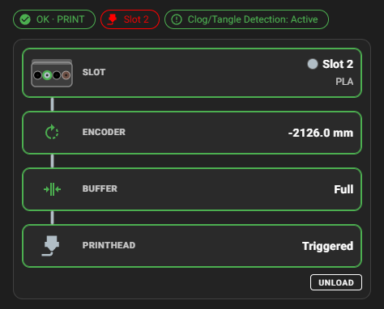 | 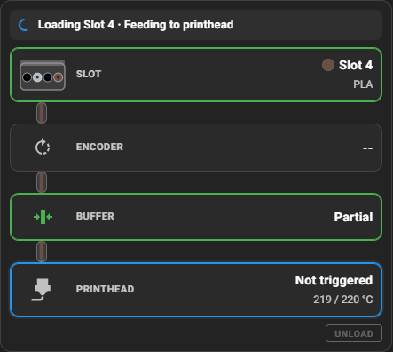 | 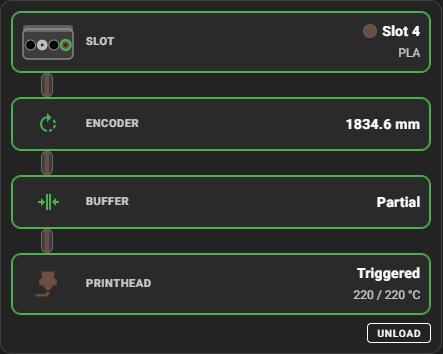 |

## 3. CFS units and slot tiles


Each CFS unit is a section titled **Box N**, with its own temperature and humidity on the right. A unit that stops answering is drawn dashed and marked **Offline**.

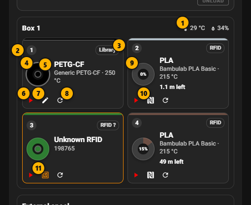

| #   | Part             | What it shows or does                                                                                                                 |
| --- | ---------------- | ------------------------------------------------------------------------------------------------------------------------------------- |
| 1   | Unit environment | temperature and humidity measured inside this CFS                                                                                     |
| 2   | Slot number      | the slot inside the unit (with several CFS units the badge also names the unit, see [Slot names](#13-slot-names))                     |
| 3   | Source badge     | where the slot data comes from: `RFID`, `RFID ?` (unknown tag), `Library`, `Spoolman` or `Manual`                                     |
| 4   | Spool            | a ring in the filament colour; the coloured stripe on top of the tile uses the same colour                                            |
| 5   | Filament         | material on the first line, then name/brand and nozzle temperature                                                                    |
| 6   | ▶ Load           | loads this physical slot into the printhead (`BOX_SELECT_SLOT`, or `T<n>` on older backends)                                          |
| 7   | ✎ Edit           | opens the [slot editor](#7-slot-editor-non-rfid-spools) of a spool without RFID tag                                                   |
| 8   | ⟳ Reread         | reads this slot's RFID tag again                                                                                                      |
| 9   | Remaining (RFID) | for RFID spools the coloured sector of the ring is the filament left, with the percentage in the centre and the metres under the name |
| 10  | RFID information | opens the [read-only RFID sheet](#8-rfid-spools)                                                                                      |
| 11  | Unknown tag      | the tag carries a material code missing from the library: this button [creates its profile](#unknown-rfid-tags)                       |

When a slot is loaded in the printhead the tile shows an **Active** tag and a coloured outline. Very dark or very light filaments get an automatic contrast outline, so black stays visible on dark themes and white on light ones.

Tile states:

| State                            | Look                                                                                                          |
| -------------------------------- | ------------------------------------------------------------------------------------------------------------- |
| Empty bay                        | dashed outline, empty dashed spool, `Empty / No filament`                                                     |
| Filament present, no profile     | grey spool, `Not set / Assign a filament`                                                                     |
| Unknown RFID tag                 | orange outline, `Unknown RFID` and the tag code                                                               |
| Very dark or very light filament | automatic contrast outline on stripe and spool, so black stays visible on dark themes and white on light ones |

Tile actions:

| Button | Action                                                                      |
| ------ | --------------------------------------------------------------------------- |
| ▶ Load | loads the physical slot (`BOX_SELECT_SLOT`, or `T<n>` on older backends)    |
| ✎ Edit | opens the [slot editor](#7-slot-editor-non-rfid-spools) for non-RFID spools |
| RFID   | shows the [read-only RFID data](#8-rfid-spools)                             |
| RFID ? | opens the library prefilled with the unknown tag, to create its profile     |
| ⟳      | rereads this slot's RFID tag                                                |

## 4. Several CFS units


The K2 accepts up to four CFS units. Each one gets its own section with its environment and online state; the external spool always has a separate section.

- With the K2-OpenHost backend's `boxes` status list, every unit shows its **own** temperature and humidity.
- With older backends the units are grouped from the slot index. Only the unit on the load path then shows the environment.
- Slot names include the unit (`B2·S4`) only when more than one CFS is connected. See [Slot names](#13-slot-names).
- On very wide panels two units are placed side by side.

## 5. Runout swap

| One CFS                                                                                         | Several CFS (simulated)                                                                           |
| ----------------------------------------------------------------------------------------------- | ------------------------------------------------------------------------------------------------- |
| 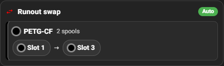 |  |

When the backend's automatic runout swap is on (green **Auto** badge), spools of the same material and colour form a **group**. If the loaded spool runs out mid-print, the backend continues on the next spool of its group without pausing.

For each group the section shows:

- its colour (side bar and swatch), material and spool count;
- the strategy, for example `lowest remaining first`;
- the order of the spools, with RFID remaining.

During a print the group in use is marked **active** and its loaded spool shows **in use**. A sequence that does not belong to any recognised group gets its own highlighted row.

## 6. Settings menu

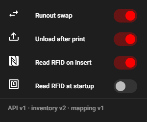

| Switch               | Backend setting                                                                                                           |
| -------------------- | ------------------------------------------------------------------------------------------------------------------------- |
| Runout swap          | `_BOX_SET_RUNOUT_SWAP` — automatic swap to an identical spool                                                             |
| Unload after print   | `_BOX_SET_UNLOAD_AFTER_PRINT` — unload the filament when a print completes                                                |
| Read RFID on insert  | `_BOX_SET_RFID_INSERT_READING` — read a tag when a spool is inserted                                                      |
| Read RFID at startup | `_BOX_SET_RFID_STARTUP_READING` — full RFID sweep at printer start (off by default; cached slots are restored without it) |

The footer shows the API, inventory and print-mapping contract versions. On phones narrower than 360 px the filament library and RFID scan move into this menu, so the panel title stays readable.

## 7. Slot editor (non-RFID spools)

Use the slot editor to tell the printer which filament is in a bay whose spool has no RFID tag (or a tag the CFS cannot read). It assigns a **profile from the [filament library](#9-filament-library-filament-database)** and the **colour of this spool**.

**Step by step**

1. On the slot tile press **✎ Edit**. The editor opens with the current assignment.
2. **Brand**: pick the manufacturer. The list contains every brand that has at least one profile.

   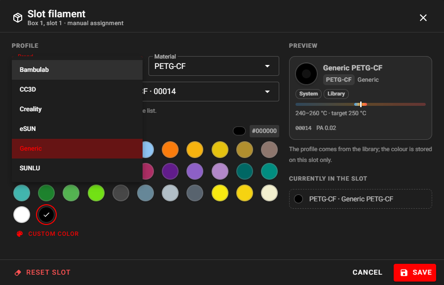

3. **Material**: pick the material family. Only the materials of that brand are listed.

   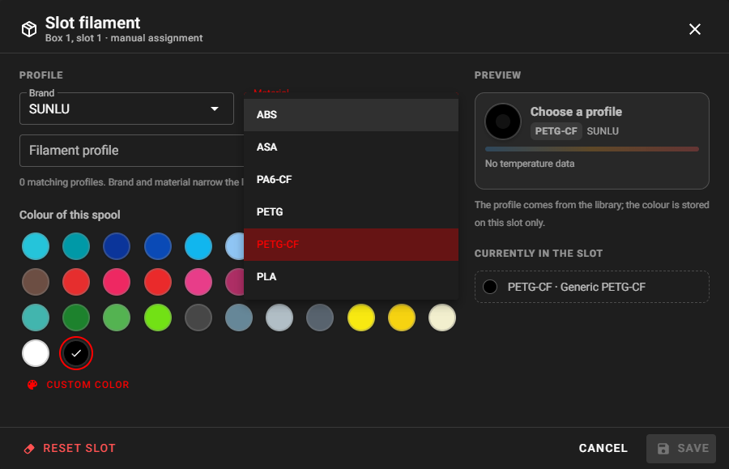

4. **Filament profile**: pick the exact profile. Each row shows brand, material, origin (`System`, `Custom`, `Imported`) and ID; you can also type to search. Brand and material only narrow this list: the counter under it says how many profiles match.

   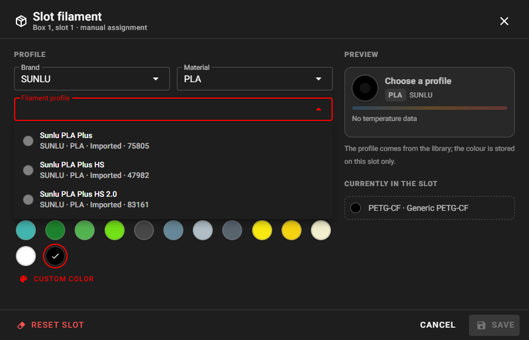

5. **Colour of this spool**: pick the colour from the palette. The **Preview** on the right shows the card exactly as it will be stored, with the profile's temperatures and pressure advance; **Currently in the slot** shows what the bay holds now.

   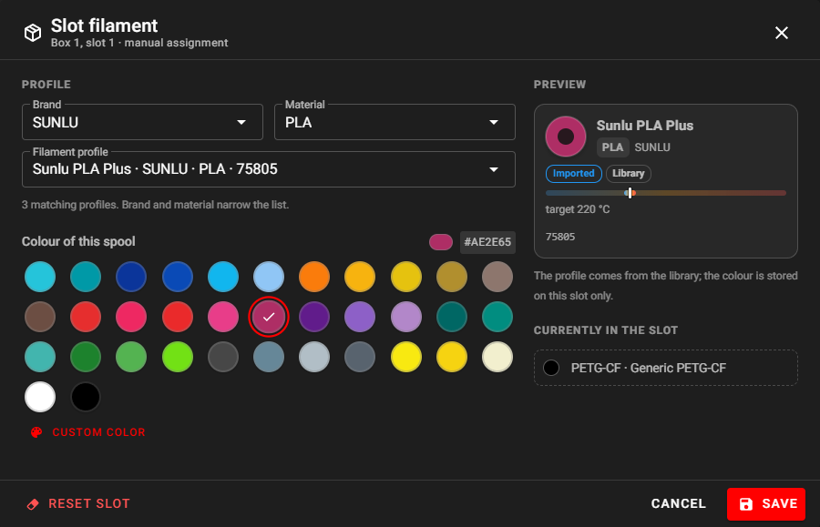

6. For a colour that is not in the palette press **Custom color** and use the picker or type the hex code.

   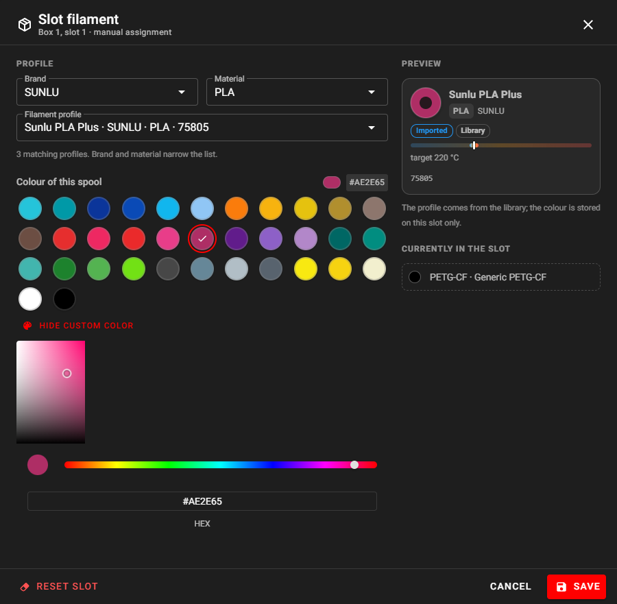

7. Press **Save** (`_BOX_SLOT_ASSIGN SLOT=<n> FILAMENT_ID=<id> COLOR=<hex>`). The tile updates at once.

Good to know:

- The colour belongs to this slot only; it does not change the profile.
- **Reset slot** clears this bay's assignment (`_BOX_SLOT_CLEAR`); the library profile stays available.
- If the filament you have is not in the list, [create its profile](#10-example-adding-a-custom-filament) first.
- Manual editing is disabled while a slot is managed by a live RFID tag; removing the tagged spool frees the slot.
- On phones the editor opens full screen, with the preview on top:

  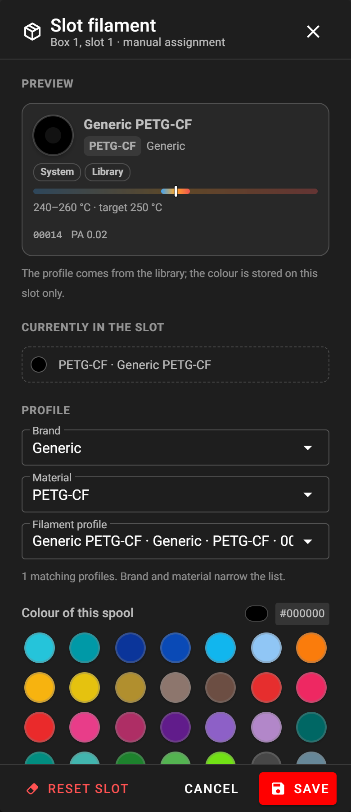

### External spool

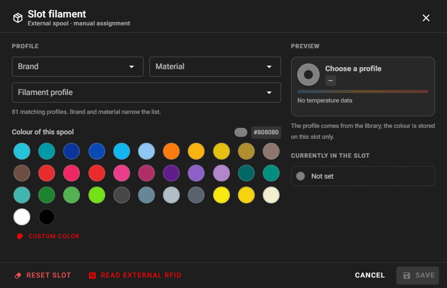

The external spool (fed from the back of the printer, outside the CFS) uses the same editor from its tile. **Read external RFID** reads a tagged spool with the external RFID reader (`RFID_READER_READ`) and fills in its profile.

## 8. RFID spools


RFID-managed slots open a read-only sheet:

- **Filament on the tag**: the profile card, with the remaining filament drawn as a sector of the spool and the `RFID`, `Read only` and tag code badges.
- **Remaining**: a bar in the spool colour with the percentage and metres left.
- **Tag details**: material, full name, brand, colour, RFID code, filament ID, nozzle temperature and pressure advance.

**Reread RFID** reads the tag again (`_BOX_RFID_READ_SLOT`).

### Unknown RFID tags

A tag written with the [K2-RFID app](https://github.com/DnG-Crafts/K2-RFID) can carry a material code that is not in the library yet, for example a custom material you added in the app. The tile then shows an orange outline, `Unknown RFID`, the tag code and the **RFID ?** badge:

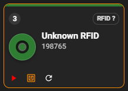

1. Press the orange **tag button** on the tile.
2. The library opens a new profile already filled in with the tag code (`RFID material code`), the matching ID (the code without its leading `1`) and the spool colour read from the tag:

   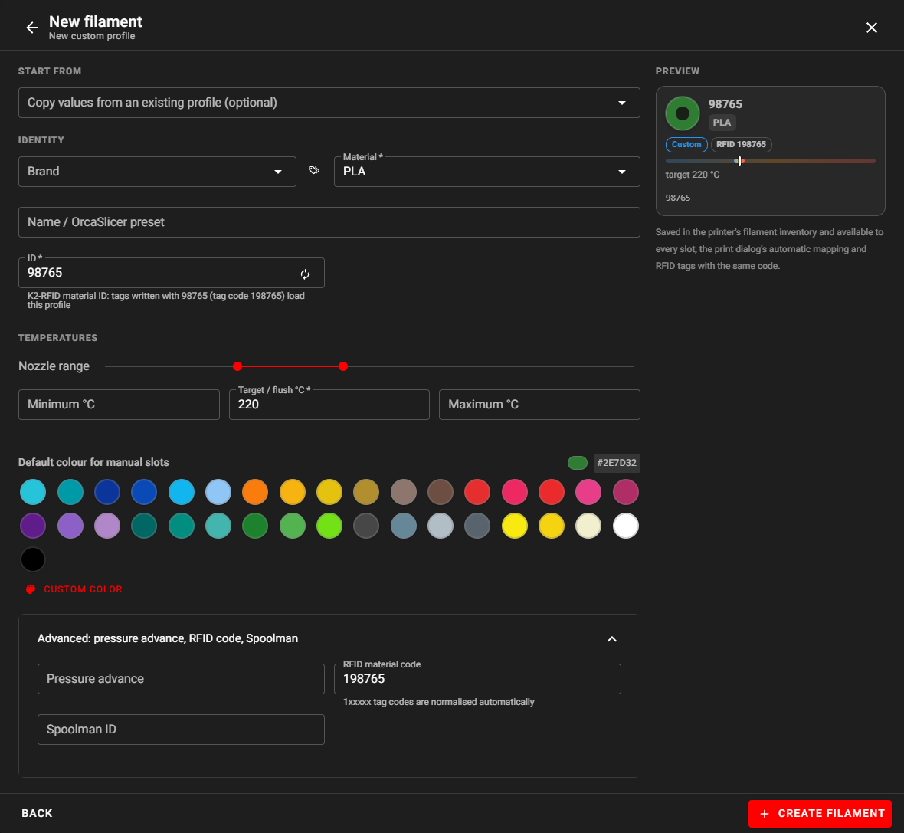

3. Complete brand, material, name and temperatures as in the [example](#10-example-adding-a-custom-filament), then press **Create filament**.
4. The slot resolves at once: the tile shows the new profile with the `RFID` badge, and every other spool with the same tag code uses it too.

Codes follow the DnG-Crafts/K2-RFID scheme: five-digit material IDs on the library side, `1xxxxx` tag codes on the spool.

## 9. Filament library (filament database)

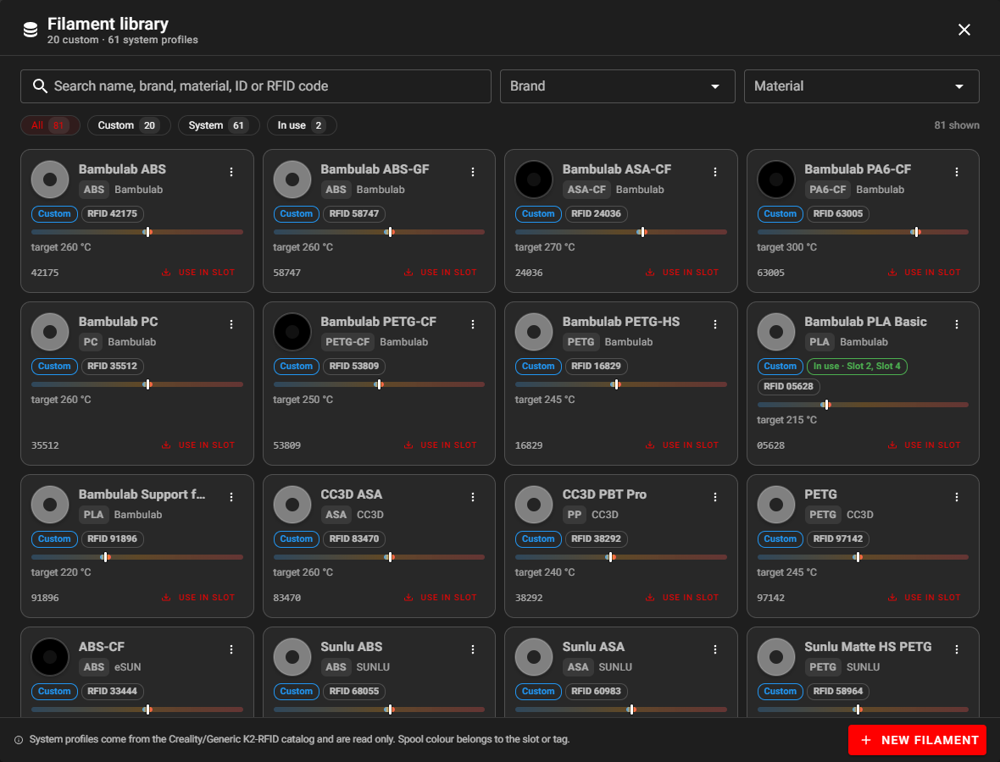

The library holds the read-only **system catalog** shipped with K2-OpenHost (the Creality and Generic profiles of the public K2-RFID database) and your **custom** profiles. Custom profiles come first, then the catalog by brand and name.

Open it with the **database button** in the panel header (on phones from the settings menu).

**Finding a profile**

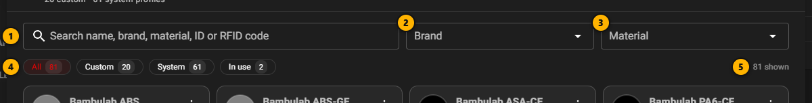

| #   | Control       | Use                                                                                                |
| --- | ------------- | -------------------------------------------------------------------------------------------------- |
| 1   | Search        | matches name, brand, material, ID and RFID code while you type                                     |
| 2   | Brand         | shows only one brand                                                                               |
| 3   | Material      | shows only one material (the list follows the chosen brand)                                        |
| 4   | Quick filters | **All**, **Custom** (yours, imported or registered from tags), **System**, **In use**, with counts |
| 5   | Shown         | how many profiles match; an empty result offers **Clear filters**                                  |

For example, searching `PETG` with the **Custom** filter lists your PETG profiles:

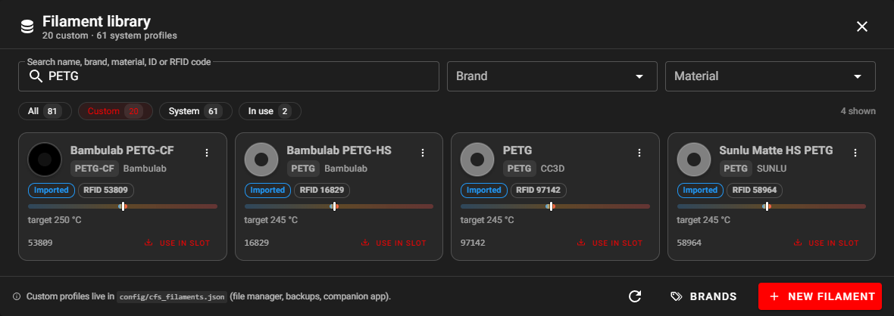

**Reading a profile card**

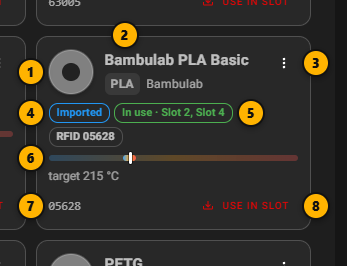

| #   | Part            | Meaning                                                                                   |
| --- | --------------- | ----------------------------------------------------------------------------------------- |
| 1   | Spool           | the profile's default colour for manual slots                                             |
| 2   | Name            | name (ideally the OrcaSlicer preset name), material and brand                             |
| 3   | ⋮ Menu          | duplicate, create a custom copy of a system profile, edit or delete (see below)           |
| 4   | Origin          | `System` (catalog, read only), `Custom`, `Imported` (K2-RFID database) or `From RFID tag` |
| 5   | In use          | the slots currently using the profile; the next badge is the RFID material code           |
| 6   | Temperature bar | the nozzle range on a 150–350 °C scale; the white marker is the target/flush temperature  |
| 7   | Footer          | ID (the K2-RFID material ID), pressure advance and Spoolman ID when set                   |
| 8   | Use in slot     | assigns the profile to a slot without opening the slot editor                             |

**Actions on a profile**

- **Use in slot** lists every present, non-RFID slot and the external spool, with what each one holds now. Choosing one assigns the profile (`_BOX_SLOT_ASSIGN`).

  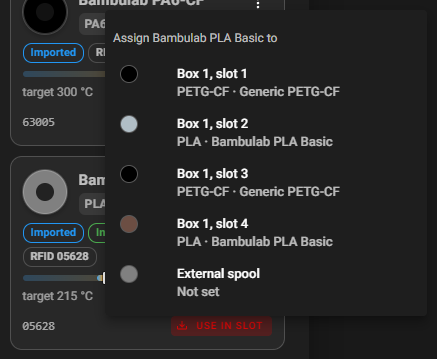

- The **⋮ menu** offers **Create custom from this** for system profiles, and **Duplicate**, **Edit** and **Delete** for custom ones.
- **Delete** asks for confirmation and names the slots that use the profile; those slots keep their values as manual metadata.

  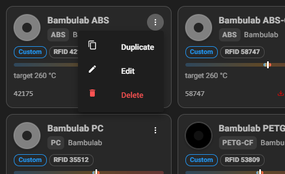
  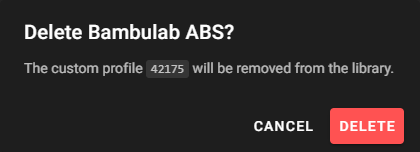

**Creating and editing a profile**

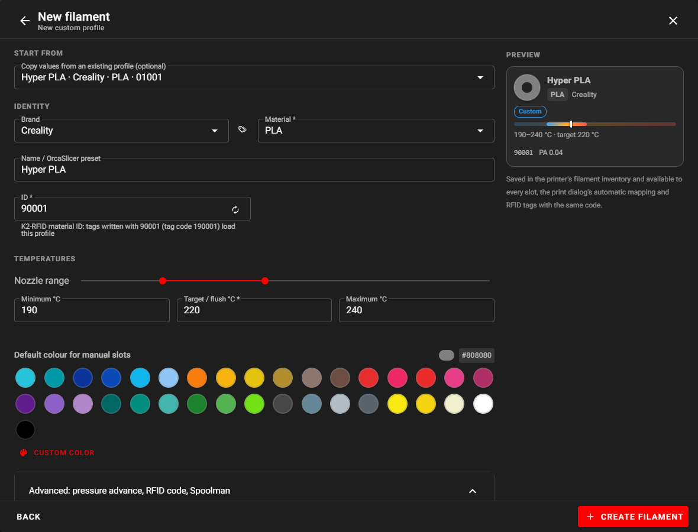

The editor is split into sections, with a live **preview** of the card:

1. **Start from** (new profiles): search any system or custom profile and copy its values. The ID and RFID code you already set are kept.
2. **Identity**:
   - **Brand**: choose one from the list or type a new one. The typed text counts at once, even if you press **Create** without Enter. The tag button next to the field opens **Brands** (below).
   - **Material**, from the known material families;
   - **Name**, ideally the OrcaSlicer preset name, so automatic slot mapping can match it;
   - **ID**: a free 5-digit ID (from 90001) is generated. It is the K2-RFID material ID: the hint shows the tag code (`1` + ID) that loads this profile. The editor refuses an ID that belongs to a system profile or to an existing custom profile, which the backend would otherwise overwrite.
3. **Temperatures**: a range slider plus minimum, target/flush and maximum fields. The target must lie inside the range.
4. **Colour**: the default colour for manual slots, from the palette or a custom colour.
5. **Advanced**: pressure advance (0–2), RFID material code (`1xxxxx` tag codes are normalised) and Spoolman ID.

**Create filament** stays disabled until every field is valid. A tag with an unknown RFID code opens this editor prefilled with the tag's code and colour.

**Brands**

| Brand list                                                                            | Deleting a brand in use                                                                             |
| ------------------------------------------------------------------------------------- | --------------------------------------------------------------------------------------------------- |
|  | 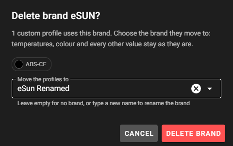 |

**Brands** (library footer, or the tag button next to the Brand field) lists every brand with what uses it:

- **Add** a brand, so it is offered in the editor before any profile uses it. A brand typed in the editor joins the list when the profile is saved.
- **Delete** removes a brand nobody uses at once.
- For a brand used by custom profiles, **Delete** asks where those profiles go: another brand, none, or a new name, which renames the brand. Only the brand changes; temperatures, colour and every other value stay as they are. **Show profiles** filters the library on that brand.
- Brands of the system catalog are locked.

Added brands are stored in Mainsail's settings on the printer (Moonraker database, namespace `mainsail`, key `cfs.customBrands`), so every browser sees them.

**Where profiles are saved**

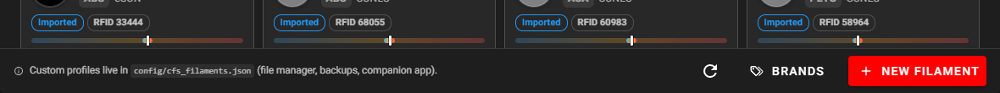

Custom profiles live in their own file, `config/cfs_filaments.json` (backend `library_path`), named in the library footer:

- it shows up in Mainsail's file manager and in Moonraker backups;
- it can be edited or replaced from the file manager, the Moonraker file API or a companion app. The backend reloads it within a few seconds, or at once with the reload button (`_BOX_FILAMENT_RELOAD`), and slots using a changed profile follow it;
- a damaged file is never overwritten: the library shows the error and changes are refused until the file is fixed.

The file uses the same compact format as the system catalog: a `materials` list with `id`, `brand`, `name`, `material`, `color`, `target_temp`, `min_temp`, `max_temp`, `pressure_advance`, `rfid_codes`, `aliases`, `spoolman_id` and `source`. These keys keep the integrations working:

| Integration      | Key                                                                                          |
| ---------------- | -------------------------------------------------------------------------------------------- |
| K2-RFID tags     | `id` (5 digits) and `rfid_codes` (`1` + ID): write a tag with that material ID               |
| OrcaSlicer       | `name` (preset name) for automatic mapping                                                   |
| Spoolman         | `spoolman_id`                                                                                |
| K2-RFID database | `material_database_path` is imported when its content changes; deleted profiles stay deleted |

On phones the library opens full screen:

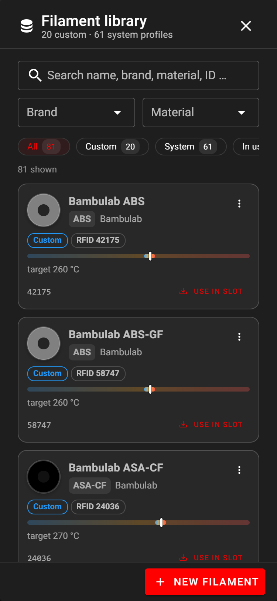

## 10. Example: adding a custom filament

This example adds **Polymaker PolyTerra PLA**, a filament whose brand is not in the library yet, assigns it to slot 1 and prepares it for a K2-RFID tag and Spoolman. The same steps work for any filament.

**1. Open a new profile.** In the library press **New filament**. A free ID (from `90001`) is already filled in.

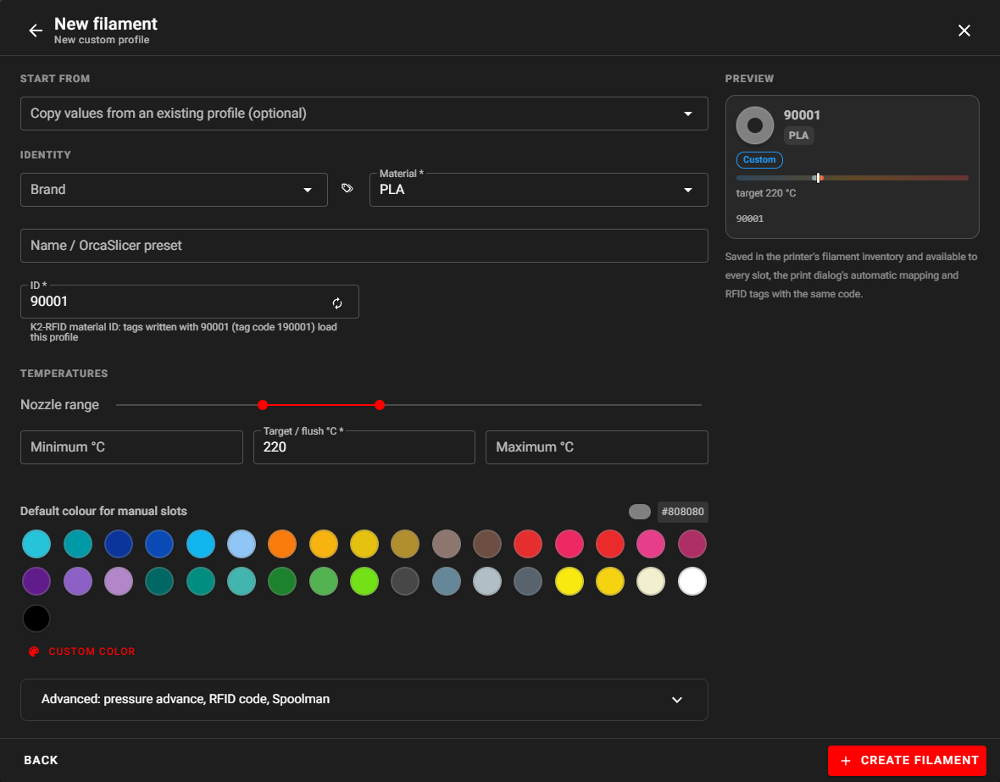

**2. Start from a similar profile.** In **Start from** type `Generic PLA` and pick it: material, temperatures and pressure advance are copied, so you only change what differs. The ID stays yours.

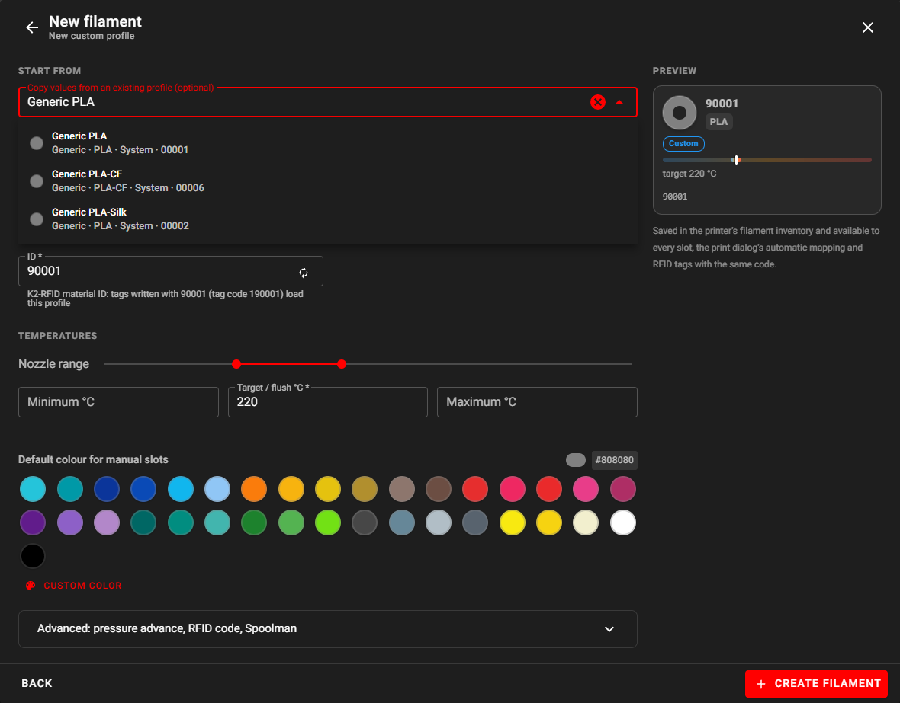

**3. Add the brand.** Press the **tag button** next to **Brand**, type `Polymaker` in **New brand** and press **Add**. The brand is now offered in every editor, even before a profile uses it. Close the dialog and choose **Polymaker** in the Brand field (typing the name there works too).

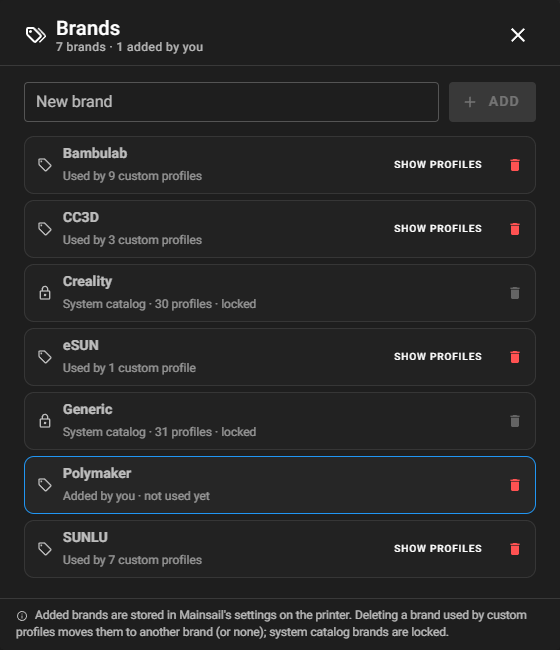

**4. Fill in the profile.**

- **Name / OrcaSlicer preset**: `Polymaker PolyTerra PLA`. Use the exact name of the filament preset in OrcaSlicer: the print dialog then maps the slicer tool to this slot automatically.
- **ID**: keep `90001`. The hint under the field says which K2-RFID tag code loads this profile (`190001`).
- **Temperatures**: minimum `190`, target `215`, maximum `230` °C (from the spool label). The target must lie inside the range; it is also the flush temperature for material changes.
- **Colour**: the default colour shown for manual slots (here green). Each slot can still use its own colour.
- **Advanced**: pressure advance `0.035` (from your calibration) and **Spoolman ID** `12` (the ID of the spool in your Spoolman server). Leave **RFID material code** empty unless the profile must answer to a different tag code.

The **Preview** on the right shows the card that will be saved. **Create filament** turns active when every field is valid.

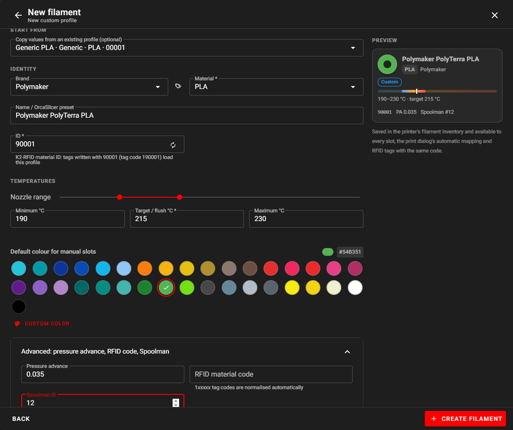

**5. Create it.** Press **Create filament**. The UI sends:

```text
_BOX_FILAMENT_SET ID="90001" MATERIAL="PLA" COLOR="#54B351" BRAND="Polymaker" NAME="Polymaker PolyTerra PLA"
                  TARGET_TEMP=215 RFID_CODE="" MIN_TEMP=190 MAX_TEMP=230 PRESSURE_ADVANCE=0.0350 SPOOLMAN_ID=12
```

The profile is saved in `config/cfs_filaments.json` and appears in the library with the `Custom` badge:

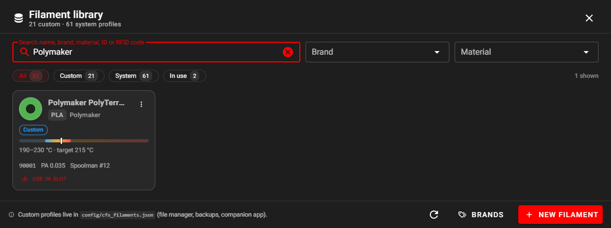

**6. Use it in a slot.** Press **Use in slot** on the card and choose the slot (here Box 1, slot 1). The [slot editor](#7-slot-editor-non-rfid-spools) does the same and also lets you pick the colour of this spool.

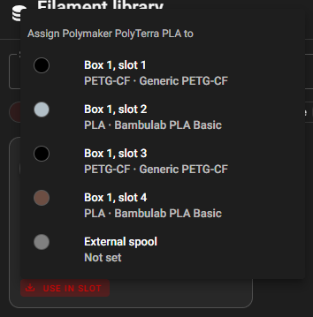

**7. Done.** The tile shows the new filament with the `Library` badge:

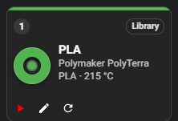

**Optional: write a K2-RFID tag for it.** In the [K2-RFID app](https://github.com/DnG-Crafts/K2-RFID) write a tag with material ID `90001` (the app's custom tag data, or a custom material with that ID). When the spool goes into the CFS, the tag code `190001` loads this profile automatically, and the remaining-filament gauge works like on Creality spools.

**Optional: Spoolman.** With Moonraker's `[spoolman]` section configured, loading a slot that uses this profile makes spool `12` the active spool, so Spoolman tracks how much filament it uses.

Pictures 5–7 were taken with the commands intercepted, so the reference machine's library was not changed; the profile and the slot were then shown as the printer reports them.

## 11. Print dialog: tool → slot mapping

| Mapping                                                                                             | Filament source                                                                            |
| --------------------------------------------------------------------------------------------------- | ------------------------------------------------------------------------------------------ |
| 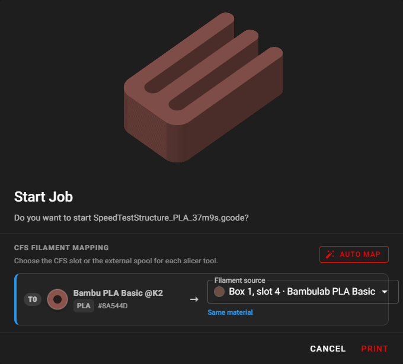 |  |

When a print starts from Mainsail, the dialog asks the backend to read the OrcaSlicer metadata of the file (`BOX_PRINT_INFO`). Each slicer tool is a row: its `T` badge, spool colour, profile and material, an arrow, and the CFS slot or external spool that will feed it. Under the source a label says how well it fits: **Same material and colour**, **Same material**, **Different material** or **Not mapped**, and the row's accent colour matches.

- **Auto map** uses the backend matcher. Exact profile matches win, compatible Generic profiles are a safe fallback, and among equivalent RFID spools the lowest remaining one is preferred.
- **Filament source** lets you change any tool. Each choice shows its live colour dot, slot name, profile and remaining filament.
- **Print** starts the job with `BOX_PRINT_START FILENAME=... MAP=tool:slot,...`. During the job the slicer's `T0`, `T1`… go to the mapped physical slots.
- A multicolour job with a tool that cannot be matched is blocked instead of guessed.
- Files without filament metadata use the normal Mainsail start.

Print starts that do not come from this dialog (OrcaSlicer upload-and-print, Moonraker API) use the same backend auto-mapper when `auto_map_prints` is enabled in `[box_print_mapping]`.

## 12. Layout on any screen

| Phone (375 px)                                                                    | Desktop column, several CFS (simulated)                                                                     |
| --------------------------------------------------------------------------------- | ----------------------------------------------------------------------------------------------------------- |
|  | 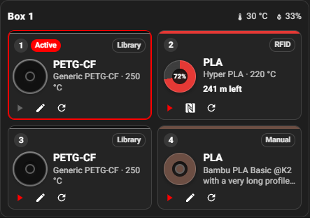 |

The layout follows the **width of the panel**, not of the screen. On a large monitor the dashboard can place the panel in a narrow column, so CSS container queries measure the panel itself:

| Width of a CFS section | Layout                                                                       |
| ---------------------- | ---------------------------------------------------------------------------- |
| 500 px or more         | four vertical tiles per row                                                  |
| 360–499 px             | two columns of compact horizontal tiles (spool on the left, half the height) |
| under 360 px           | one column of full-width tiles                                               |
| panel 1040 px or more  | two CFS units side by side                                                   |
| panel 560 px or more   | filament path in one row; below that it stacks vertically                    |

Touch screens get 36 px action buttons. Text sizes are fixed and do not scale with the viewport, so the panel looks the same in any column. Browsers without container-query support fall back to two columns.

## 13. Slot names

The UI uses the backend's wording, so names match the console messages:

| Context                                   | One CFS                  | Several CFS     |
| ----------------------------------------- | ------------------------ | --------------- |
| Full name (tooltips, dialogs, print menu) | `Box 1, slot 3`          | `Box 2, slot 4` |
| Short name (chips, runout, path)          | `Slot 3`                 | `B2·S4`         |
| External spool                            | `External spool` / `EXT` | same            |

Tiles show the slot number inside the unit (1–4); the unit is the section title. Slicer tools keep their `T0`, `T1`… names, which avoids confusing a file tool with a physical slot.

## 14. Backend contract

The panel needs the K2-OpenHost Kalico `box` extras:

```text
box.api_version            = 1
box.filament_inventory_version = 2
box.print_mapping_version  = 1
```

Fields used:

| Field                                                                                       | Purpose                                                                                                                    |
| ------------------------------------------------------------------------------------------- | -------------------------------------------------------------------------------------------------------------------------- |
| `slots[]`                                                                                   | physical slots plus the external spool: presence, loaded flag, profile, colour, RFID data, remaining                       |
| `operation`                                                                                 | running load/unload: active, kind, slot, stage, plus the change-engine step and target (_optional; newer backend_)         |
| `boxes[]`                                                                                   | one entry per CFS: address, online, status/state codes, own temperature/humidity, slot indices (_optional; newer backend_) |
| `temp_c`, `humidity_pct`                                                                    | environment of the box on the load path (fallback when `boxes` is missing)                                                 |
| `load_path`                                                                                 | source slot, encoder, buffer, printhead sensor, clog detection                                                             |
| `runout`, `runout_groups`, `runout_swap_enabled`                                            | runout sequence and groups                                                                                                 |
| `recovery`                                                                                  | blocked state and reason                                                                                                   |
| `filaments`, `materials`                                                                    | library and catalog; each filament carries `source` (_newer backend_)                                                      |
| `filament_library`                                                                          | library file path, counts and error (_optional; newer backend_)                                                            |
| `print_info`, `print_mapping`, `auto_mapping`, `print_mapping_enabled`                      | print-start mapping                                                                                                        |
| `unload_after_print_enabled`, `rfid_insert_reading_enabled`, `rfid_startup_reading_enabled` | settings switches                                                                                                          |

The printhead stage also reads `printer.extruder` and `printer['filament_switch_sensor filament_sensor']`.

`boxes[]`, `operation` and `BOX_SELECT_SLOT` come with the K2-OpenHost integration of Jacob10383's firmware sync 071c813 (merged into `kalico-k2pro` `k2-pro-openhost` on 2026-10-03, hardware tests pending). The UI detects both and falls back to slot-index grouping and `T<n>` on older backends.

## 15. Commands sent by the UI

```text
BOX_SELECT_SLOT SLOT=<n>      (or T<n> on older backends)
BOX_UNLOAD
BOX_RFID_SCAN
_BOX_RFID_READ_SLOT SLOT=<n>
_BOX_SLOT_SET / _BOX_SLOT_CLEAR / _BOX_SLOT_ASSIGN
_BOX_FILAMENT_SET / _BOX_FILAMENT_DELETE
_BOX_FILAMENT_RELOAD
_BOX_SET_RUNOUT_SWAP ENABLE=<0|1>
_BOX_SET_UNLOAD_AFTER_PRINT ENABLE=<0|1>
_BOX_SET_RFID_INSERT_READING ENABLE=<0|1>
_BOX_SET_RFID_STARTUP_READING ENABLE=<0|1>
BOX_PRINT_INFO FILENAME=<file>
BOX_PRINT_START FILENAME=<file> MAP=<tool:slot,...>
```

`BOX_SELECT_SLOT` always targets the physical slot, so a print map or a HelixScreen tool map cannot redirect a manual load. Print-driven tool changes stay under backend control.

## 16. Persistence

The backend keeps two files:

- `~/printer_data/config/cfs_filaments.json`: custom filament profiles (see [Filament library](#9-filament-library-filament-database)).
- `~/printer_data/filament_box.json`: slot assignments, remaining-filament estimates, settings and box identities.

The system catalog is read from the firmware at every start and never written, so catalog updates apply after an update. On the first start of this version, custom profiles found in `filament_box.json` move to the library file once; the old file is kept as `filament_box.json.pre-library`.

Both survive browser reloads and printer restarts.

- At startup the backend restores cached assignments for spools still present, after one presence query; it does not sweep every RFID tag.
- Removing a spool clears only that bay.
- A confirmed runout stores zero remaining and clears the empty source.

UI preferences such as added brands are Mainsail settings in the Moonraker database.

## 17. Deployment on the CM5

|                                                              | Path                                      |
| ------------------------------------------------------------ | ----------------------------------------- |
| Source checkout (Moonraker update manager, branch `develop`) | `~/mainsail-k2openhost-src`               |
| Live web root                                                | `~/mainsail`                              |
| Build and deploy helper                                      | `~/.local/bin/mainsail-k2openhost-deploy` |

The helper runs `npm ci` when `package-lock.json` changes and builds with the user's Node 22 (`~/.nvm`), because Vite needs Node 20+ and the system Node is 18. It then syncs `dist/` into the web root, keeping `config.json`. It runs from Git hooks after an update and from a once-a-minute cron check, and it refuses to deploy a dirty source tree.

## 18. Validation status

Verified on the development K2 Pro (one CFS):

- panel, slot tiles, filament path at idle, library, slot editor, RFID sheet, settings switches;
- `BOX_PRINT_INFO` and the backend auto-map suggestion;
- layout at 320, 375, 820, 1440 and 2560 px wide;
- several-CFS layout and runout groups with simulated status data.

Still to verify on hardware (see the K2-OpenHost [hardware test plan](https://github.com/MzTechnology97/K2-OpenHost/blob/main/docs/en/HARDWARE_TEST_PLAN.md)):

- a complete mapped `BOX_PRINT_START` with a real tool change, and the filament path during a print;
- automatic runout swap during a print;
- power-loss recovery of a mapped print;
- a second physical CFS unit.

## Credits

- **Mainsail** — `mainsail-crew/mainsail`, the upstream UI; this fork changes only the K2-OpenHost parts listed here.
- **Jacob10383** — `k2-plus-custom-firmware`, its Box API, `BOX_PRINT_INFO` / `BOX_PRINT_START`, logical-tool mapping, and the Filament Box widget that inspired the filament path view.
- **DnG-Crafts/K2-RFID** — RFID material catalog and colour palette.
- **HimAndRobot/creality-cfs-mainsail-integration** — UI reference for CFS slot cards. K2-OpenHost does not use its direct Creality web-server path.
