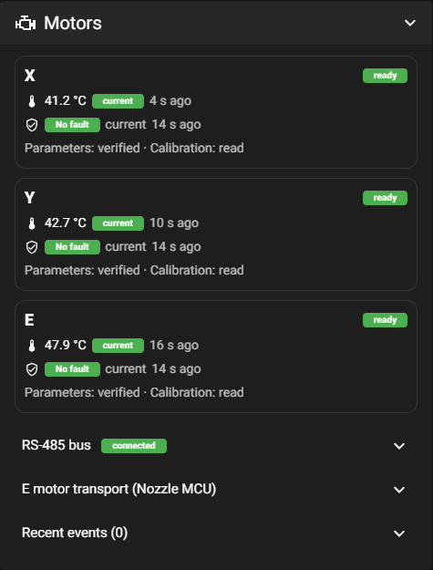
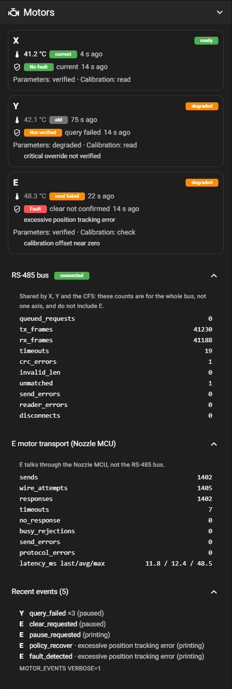
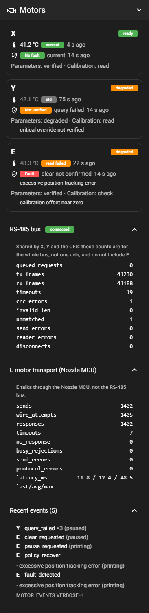
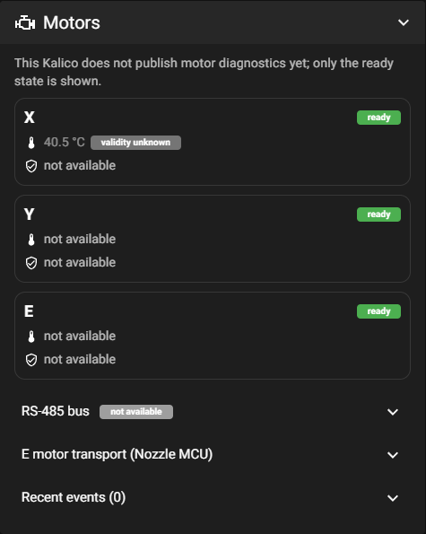

# Motors panel in Mainsail K2-OpenHost

Updated: **2026-10-04**.

The **Motors** panel shows the diagnostics of the K2 Pro closed-loop X, Y and E motors that [kalico-k2pro](https://github.com/MzTechnology97/kalico-k2pro) publishes through Moonraker. It is read only.

> [!WARNING]
> **Experienced users only — use at your own risk.** K2-OpenHost voids the manufacturer's warranty and can damage the printer beyond repair, brick its firmware or, in case of malfunction, cause a fire. The authors accept no liability for damage to property or persons.
> In OpenHost mode the **nozzle and chamber cameras** cannot be managed by the T113 and must be rewired directly to the external Linux host, and the printer's **external USB port** cannot be used to print and stops working completely in gadget mode.
> Read the [disclaimer and hardware limitations](https://github.com/MzTechnology97/K2-OpenHost/blob/main/docs/en/DISCLAIMER.md) ([italiano](https://github.com/MzTechnology97/K2-OpenHost/blob/main/docs/it/DISCLAIMER.md)) before using this repository.

All screenshots on this page use **simulated** data injected into the page; they are not readings from a printer.

## What it reads

The panel uses only objects Mainsail already subscribes to:

- `motor_control`;
- `temperature_sensor motor_X_MCU`, `motor_Y_MCU` and `motor_E_MCU`;
- `serial_485 serial485`.

It sends no G-code, queries no hardware when it renders or updates, and has no clear, reset, calibration or flash button. It appears on the dashboard when `motor_control` exists; like the other panels, it can be moved or hidden in Settings → Dashboard.

| Key                                 | Used for                                                                                   |
| ----------------------------------- | ------------------------------------------------------------------------------------------ |
| `motor_control.temperatures.<axis>` | temperature, `state`, `sample_age`, `last_error`                                           |
| `temperature_sensor motor_<A>_MCU`  | temperature when the above is missing; `valid`/`state` if present                          |
| `motor_control.faults.<axis>`       | error/warning labels, unknown bits, `query_age`, `validity.state`, `validity.clear.result` |
| `motor_control.readiness.<axis>`    | ready / degraded / blocked, `parameters.state`, `calibration.state`, `reasons`             |
| `motor_control.motor_ready`         | the ready chip on backends without `readiness`                                             |
| `motor_control.nozzle_transport`    | E transport counters and latency                                                           |
| `motor_control.events`              | the newest motor events                                                                    |
| `serial_485 serial485`              | shared RS-485 bus counters                                                                 |

**Backend versions:**

- `motor_control.temperatures` and `faults` come with kalico-k2pro #11;
- `validity` with #13, `readiness` with #14, `events` with #16 and `nozzle_transport` with #17.

Every key is optional. A missing one shows **not available**, never an error.

## The panel

Each axis card shows:

1. **Ready chip:** `ready`, `degraded` (running, but parameters or calibration not verified), `blocked` (by `override_policy: block`) or `not ready`.
2. **Temperature** of the motor MCU, with its state and age.
3. **Protection:** `No fault` only for a verified recent answer, otherwise `Not verified`, `Warning` or `Fault`. Next to it are the validity state and the age of the last valid answer.
4. **Parameters and calibration:** what the startup verified, and the reasons for anything that is not verified.

## States and colours

| Colour | Temperature                                                                  | Protection                                                     |
| ------ | ---------------------------------------------------------------------------- | -------------------------------------------------------------- |
| green  | `current`: read in this session, recently                                    | `current`: valid answer, recent                                |
| orange | `read failed`: the last read failed                                          | `query failed`; `Warning`; `Not verified`                      |
| red    | —                                                                            | `Fault`                                                        |
| blue   | —                                                                            | `clear not confirmed`: a clear was sent, no valid answer since |
| grey   | `old`, `never read`, `monitor stopped`, `before restart`, `validity unknown` | `old`, `not verified`                                          |

A grey or orange temperature keeps showing the last value in dimmed text, so it is never mistaken for a current reading. A sensor that publishes no validity at all (an older backend) is always grey, `validity unknown`.

The sections under the cards open on click:

- **RS-485 bus:** connection and counters of the bus shared by X, Y and the CFS. They are not per axis and do not include E.
- **E motor transport (Nozzle MCU):** E's own transport counters and latency.
- **Recent events:** the newest motor events, newest first, with repeat counts. `MOTOR_EVENTS VERBOSE=1` in the console gives the full history as JSON for a report.

On a phone the cards stack:

## Older backend

With a Kalico that publishes only `motor_ready`, the panel says so. It shows the ready state and any temperature sensor marked `validity unknown`.

## Verifying it (read only)

1. Open the dashboard: the Motors panel shows while Klipper is ready and `motor_control` exists.
2. After `FIRMWARE_RESTART`, the temperatures go `monitor stopped` → `before restart` → `current` within about 18 s of `motor_ready`.
3. The protection column turns `current` after the first 60 s poll.

No step of this check sends a command to the motors.

## Translations

The panel's texts are in `Panels.MotorsPanel` of `src/locales/en.json` and `it.json`; a unit test checks that both have the same keys. Other languages fall back to English.
